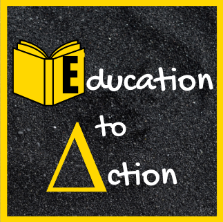

# Education to Action LLC

This project documents the migration of Education to Action's web presence from a Wix-hosted site at education2action.com to a custom-built, self-hosted site at educationtoaction.net on GitHub Pages.
Education to Action is built on a simple belief: knowledge without action changes nothing. This migration is about owning that philosophy at every level, including the infrastructure behind the work. Moving off Wix gives us full control over how the mission shows up online: faster, cleaner, and no longer behind a platform we don't own.

## Acknowledgements

This project was built with the help of the following tools:

[Claude.ai](https://claude.ai)
:   Used for project documentation and technical guidance throughout the migration process.

[Favicon.io](https://favicon.io)
:   Used to generate the site favicon.

[Readme.so](https://readme.so)
:   Used to structure and assemble this README.

## Authors

- [@jfraz757](https://github.com/jfraz757)

## Deployment

## Deployment

This site is deployed via [GitHub Pages](https://pages.github.com) directly from the `main` branch.

To deploy updates:

1. Clone the repository
2. Make changes locally
3. Push to the `main` branch

GitHub Pages will automatically reflect changes at [educationtoaction.net](https://educationtoaction.net).

## 🚀 About Me
Strategic ops leader bridging social equity and tech. Proud Code Louisville participant building skills in Python, SQL, and Git.

## 🔗 Links

## License

This work is licensed under a [Creative Commons Attribution-NonCommercial 4.0 International License](https://creativecommons.org/licenses/by-nc/4.0/).

You are free to share and adapt this work with attribution, but it may not be used for commercial purposes.

